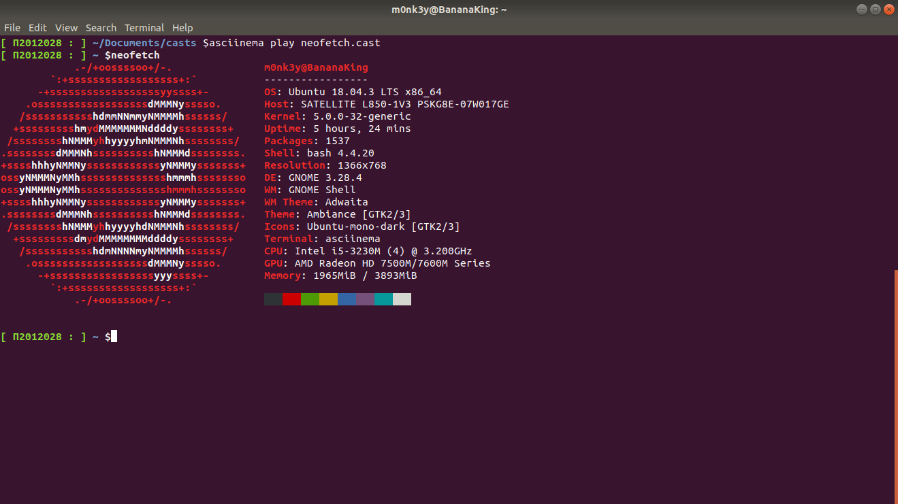
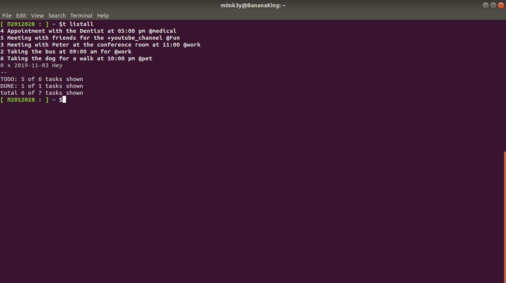
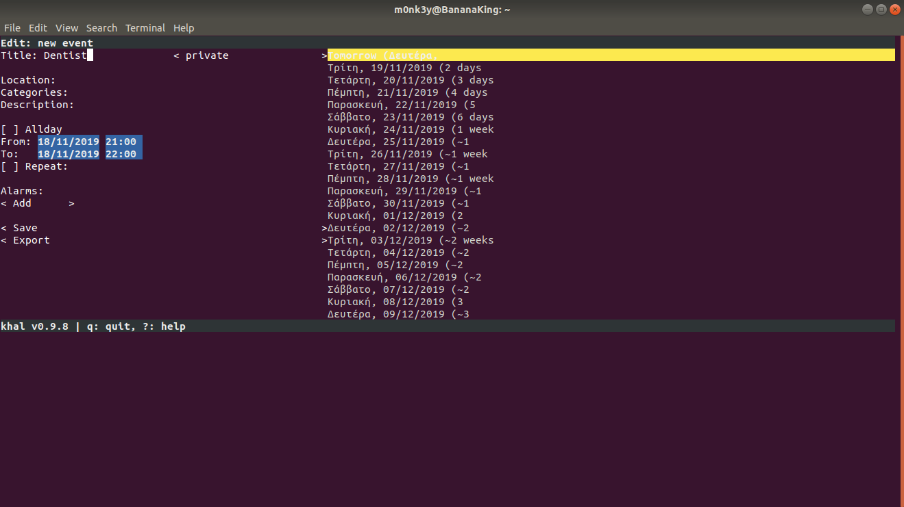
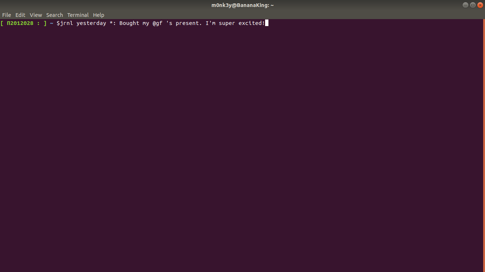
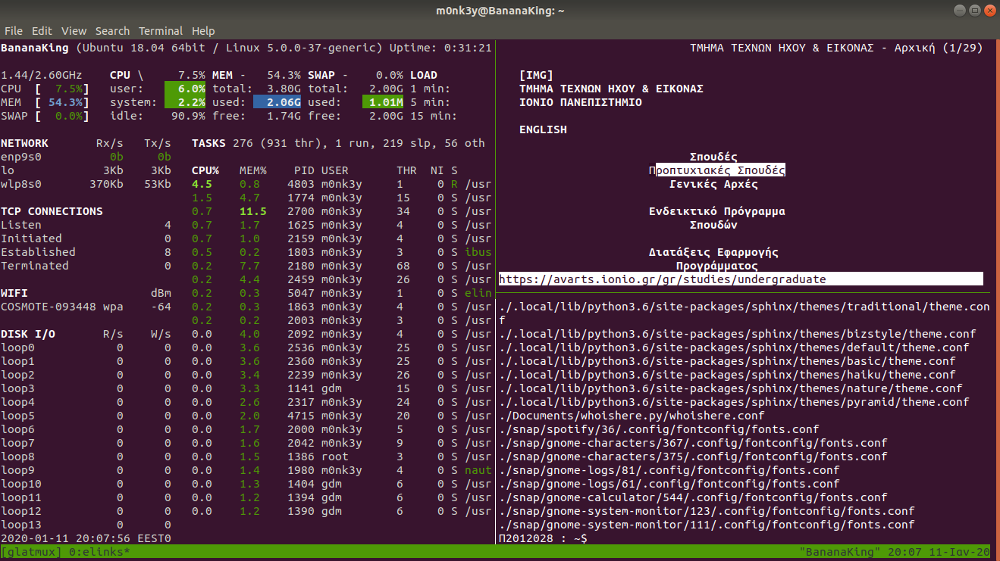
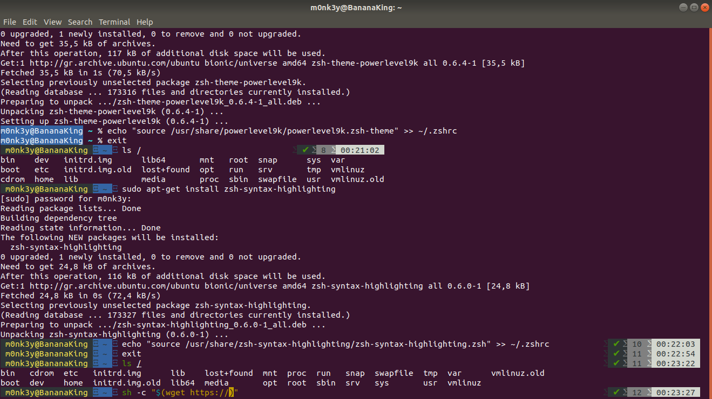

# *Επικοινωνία Ανθρώπου Υπολογιστή: Τελική Αναφορά*

##  *Τίτλος*: HCI Dokey

## *ΑΜ* : Π2012028
## *Ονοματεπώνυμο* : Μώκος Θεόδωρος

### [HCI Repository](https://github.com/TheoMokos/hci/tree/master/projects/2012028)
### [GR Repository](https://github.com/TheoMokos/gr)
### [Εκτελέσιμο](https://theomokos.github.io/gr/)

## *Εισαγωγή*
  
  Το παρόν αποτελεί την τελική αναφορά για το Μάθημα της Επικοινωνίας Ανθρώπου-Υπολογιστή, μάθημα του Γ´ εξαμήνου.
  
## *Σύνοψη*
  H παρακάτω αναφορά αποτελείται από παραδοτέα. Το πρώτο παραδοτέο περιέχει την ολοκλήρωση των δύο πρώτων εργασιών
  καθώς και τις πρώτες απαιτήσεις του συμμετοχικού περιεχομένου ενώ το δεύτερο παραδοτέο περιέχει τις υπολοιπες τέσσερις
  εργασίες υψηλότερου επιπέδου καθώς και τις τελικές απαιτήσεις του συμμετοχικού περιεχομένου, στην δική μου περίπτωση 
  ένα διαδραστικό παράδειγμα και μια βιογραφία.
  
## *Σύντομη ανάλυση σχετικών έργων και εργαλίων*

  Το λειτουργικό σύστημα που χρησιμοποιήθηκε είναι τα Ubuntu LTS 18.04 σε Dual Boot Laptop. Για την ολοκλήρωση των απαιτήσεων 
  των ασκήσεων χρησιμοποιήθηκε το asciinema για την καταγραφή του τερματικού αλλά και αρκετά πακέτα και εφαρμογές εκ των    οποίων
  τα : python , neofetch, todo-cli, jrnl, khal, tmux και zsh. Για τα κομμάτια του συμμετοχικού περιεχομένου χρησιμοποιήθηκε η 
  πλατφόρμα του github με την οποία έγινε και η υποβολή των εργασιών και αναφορών. Σχετικές απορίες και προβλήματα ως αφορά τις 
  εργασίες έλυσαν τα man-pages ενώ για το συμμετοχικό περιεχόμενο το Cope Pen, καθώς και το site του asciinema λόγο προβλήματων στην έκτη άσκηση με την αλλαγή από bash σε zsh.
  
## *Μέθοδοι και τεχνικές ανάπτυξης*

  Στην **_πρώτη_** εργασία χρησιμοποίησα το nano για να αλλάξω τον τίτλο του τερματικού μου στο ΑΜ μου, την εντολή ls για την     εμφάνιση των κρυφών αρχείων και το neofetch για την εμφάνιση των χαρακτηριστικών του hardware και software. Στη **_δεύτερη_** εργασία, έπαιξα με το todo-cli, μία task schedule εφαρμογή και βάση αυτής δημιούργησα, τροποιποίησα και διέγραψα τα αντίχτοιχα tasks. Στην **_τρίτη_** εργασία , χρησιμοποίησα την εφαρμογή khal όπου και έφτιαξα πάνω σε συγκεκριμένες ημερομηνίες
του ημερολογίου κάποια todo's. Στην **_τέταρτη_** εργασία χρησιμοποίησα το jrnl, που σου επιτρέπει να κρατήσεις σημειώσεις ημερολογίου μέσω του terminal, ενώ κατα την αποθήκευση τις κρυπτογραφούσε. Στην **_πέμπτη_** εργασία, χρησιμοποίησα το tmux,
με ταυτόχρον εκτέλεση του πακέτου glances(--dissable-plugin ip για την αφαίρεση της IP διεύθυνσης), ενώ σε άλλα παράθυρα σέρφαρα στο internet μέσω του terminal browser elinks και έκανα τοπική αναζήτηση αρχείων. Τέλος, στην **_έκτη_** εργασία , μετέτρεψα το bash σε zsh , ενώ πρόσθετα το module oh-my-zsh που μου επέτρεψε λειτουργίες όπως αυτόματη συμπλήρωση εντολών αλλά και ο χρωματισμός αυτών.
  
 Στα πλαίσια του **_Παραδοτέου Α_**, πρόσθεσα πέντε εικόνες στο αντίγραφο TheoMokos/gr/ ως εξής: πρόσθεσα τα .md αρχεία
στο φάκελο _gallery και έπειτα τις αντοίστιχες εικόνες και τα thumb τους στο φάκελο images. Για το **__Παραδοτέο Γ_**,
πρόσθεσα τη βιογραφία του Bill Buxton. Δημιούργησα τα αρχεία bio-buxton.md (αρχείο βιογραφίας) και bill-buxton.md (αρχείο κώδικα) και τα πρόσθεσα στο φάκελο _biography. Οι αντίστοιχες εικόνες του αρχείου bio-buxton.md τοποθετήθηκαν στο φάκελο images μαζί με τα thumb τους. 
  

## Ενδεικτικές οθόνες

### Εργασία 1
 
 #### Ζητούμενα -> set-up the main dependencies and demonstrate your base system
 
 **Πραγματοποιήθηκαν τα εξής:**
 
 - [x] ***Αλλαγή του τερματικού σε ΑΜ***

 - [x] ***Εμφάνιση κρυφών αρχείων***

 - [x] ***Εμφάνιση αρχείου διαμόρφωσης του bash***

 - [x] ***Εμφάνιση χαρακτηριστικών συστήματος( υλικό και λογισμικό)***

 | Links εκτελέσιμων |
 | --- |
 | [toAm](https://asciinema.org/a/TXBRaPjbziu4JQSfAkq9T6HIf) |
 | [dotFiles](https://asciinema.org/a/WdhqZg9LEqfSvaBrTjWXYJPRK) |
 | [shellFiles](https://asciinema.org/a/ovDtc2nUL4D963ewIF6aSe5Gz) |
 | [display_S_and_H](https://asciinema.org/a/I56M7mG6Ue3AxoMuHrJVk7P1Q)|

   

  ### Εργασία 2
 
 #### Ζητούμενα -> become productive with a todo list
 
 **Πραγματοποιήθηκαν τα εξής:**
 
 - [x] ***Δημιουργία todo tasks με tags(@) και projects(+)***

 - [x] ***Eπεξεργασία , προβολή και διαγραφή αυτών***

 | Links εκτελέσιμων |
 | --- |
 | [todo](https://asciinema.org/a/oTU6rj75LDicPk7YNuaK0OlMn) |
 | [todo_view_delete_edit](https://asciinema.org/a/6n4yisUM1RSpSHiD8fVc5ROMI) |

 
 
  
 ### Εργασία 3
 
 #### Ζητούμενα -> play your time with calendar
 
 **Πραγματοποιήθηκαν τα εξής:**
 
 - [x] ***Δημιουργία event στο khal***

 - [x] ***Προβολή interactive mode***

 | Links εκτελέσιμων |
 | --- |
 | [khal](https://asciinema.org/a/gG02FQPSvYsU0g9A3jEVCTqPy) |

 
 
  
 
 ### Εργασία 4
 
 #### Ζητούμενα -> track your time with a journal
 
 **Πραγματοποιήθηκαν τα εξής:**
 
 - [x] ***Δημιουργία ημερολογίου***

 - [x] ***Επεξεργασία και διαγραφή αυτών***

 | Links εκτελέσιμων |
 | --- |
 | [jrnl](https://asciinema.org/a/zqDbgRO4S8p59zsO55kHvxagr) |

 
 
 
 ### Εργασία 5
 
 #### Ζητούμενα -> organize terminal into multiple areas
 
 **Πραγματοποιήθηκαν τα εξής:**
 
 - [x] ***Χρήση tmux***

 - [x] ***Ταυτόχρονη εμφάνιση συστήματος, αναζήτηση στο internet και τοπική αναζήτηση αρχείων***

 | Links εκτελέσιμων |
 | --- |
 | [tmux](https://asciinema.org/a/Qus1NRAWm9dmJXcQrp3e5yaQG) |

 
  
  
 ### Εργασία 6
 
 #### Ζητούμενα -> try a different shell
 
 **Πραγματοποιήθηκαν τα εξής:**
 
 - [x] ***Χρήση zsh, oh-my-zsh***

 - [x] ***Εφαρμογή auto-completion, syntax-highlighting***

 | Links εκτελέσιμων |
 | --- |
 | [zsh](https://asciinema.org/a/mM43mJ76eyqI4zvNTNf0bXW6O) |

 
 
 
 
## Εργασία Συμμετοχικού περιεχομένου
## Παραδοτέο Α

Προσθήκη πέντε φωτογραφιών στο αντίγραφο του βιβλίου του μαθήματος. 
| Images | Thumbnail | Original | (.md) |
| --- | --- | --- | --- |
| Nintendo Switch |    [nintendo_switch_thumb.jpg](https://github.com/TheoMokos/gr/blob/gh-pages/images/nintendo_switch_thumb.jpg)  	|    [nintendo_switch.jpg](https://github.com/TheoMokos/gr/blob/gh-pages/images/nintendo_switch.jpg)   	|   [nintendo_switch.md](https://github.com/TheoMokos/gr/blob/gh-pages/_gallery/nintendo_switch.md)   	|
| Kindle E-Reader |    [kindle_thumb.jpg](https://github.com/TheoMokos/gr/blob/gh-pages/images/kindle_thumb.jpg)    	|     [kindle.jpg](https://github.com/TheoMokos/gr/blob/gh-pages/images/kindle.jpg)    	|    [kindle.md](https://github.com/TheoMokos/gr/blob/gh-pages/_gallery/kindle.md)    	|
| Floppy Disk |   [floppy_disk_thumb.jpg](https://github.com/TheoMokos/gr/blob/gh-pages/images/floppy_disk_thumb.jpg)   	|    [floppy_disk.jpg](https://github.com/TheoMokos/gr/blob/gh-pages/images/floppy_disk.jpg)   	|   [floppy_disk.md](https://github.com/TheoMokos/gr/blob/gh-pages/_gallery/floppy_disk.md)   	|
| Amazon Echo Dot Speaker |       [amazon_dot_speaker_thumb.jpg](https://github.com/TheoMokos/gr/blob/gh-pages/images/amazon_dot_speaker_thumb.jpg)       	|        [amazon_dot_speaker.jpg](https://github.com/TheoMokos/gr/blob/gh-pages/images/amazon_dot_speaker.jpg)       	|        [amazon_dot_speaker.md](https://github.com/TheoMokos/gr/blob/gh-pages/_gallery/amazon_dot_speaker.md)      	|
| Sony PS One | [sony_ps_one_thumb.jpg](https://github.com/TheoMokos/gr/blob/gh-pages/images/sony_ps_one_thumb.jpg) 	|  [sony_ps_one.jpg](https://github.com/TheoMokos/gr/blob/gh-pages/images/sony_ps_one.jpg) 	| [sony_ps_one.md](https://github.com/TheoMokos/gr/blob/gh-pages/_gallery/sony_ps_one.md) 	| 
 
  
 ## Παραδοτέο Β
 
 Προσθήκη βιογραφίας Bill Buxton
 
 | **Name** | **Repository** | **Runnable** |
 | --- | --- | --- |
 | Bill Buxton | [Buxton repository](https://github.com/TheoMokos/gr/tree/gh-pages/_biography) | [Buxton runnable](https://theomokos.github.io/gr/biography/bill-buxton/) |
 
 | **Image** | **Thumb** |
 | --- | --- |
 | [bb](https://github.com/TheoMokos/gr/blob/gh-pages/images/bill-buxton.jpg) | [bb-thumb](https://github.com/TheoMokos/gr/blob/gh-pages/images/thumb_bill-buxton.jpg) |
 | [bb-sssp](https://github.com/TheoMokos/gr/blob/gh-pages/images/buxton-sssp.jpg) | [bb-sssp-thumb](https://github.com/TheoMokos/gr/blob/gh-pages/images/thumb-buxton-sssp.jpg) |
 | [bb-synth](https://github.com/TheoMokos/gr/blob/gh-pages/images/buxton-computersynth.jpg) | [bb-synth-thumb](https://github.com/TheoMokos/gr/blob/gh-pages/images/thumb-buxton-computersynth.jpg) |
 
 
  

 ## Συμπεράσματα
 
  Σκοπός των εργασιών αυτών ήταν οι εξικείωση μας με το τερματικό σε αρχικό και πιο υψηλό επίπεδο, καθώς και της ακαδημαικής συνεισφοράς μέσω του συμμετοχικού υλικού. Επίσης μας βοήθησαν να εμβαθύνουμε στις λειτουργίες τις πλατφόρμας του github, ενός πλέον απαραίτητου εργαλείου.
  
  
 ## Παραπομπές
 
 * https://en.wikipedia.org/wiki/Bill_Buxton
 * https://www.microsoft.com/en-us/research/people/bibuxton/
 * https://peoplepill.com/people/bill-buxton/
 * https://www.billbuxton.com/ssspDigital.pdf
 * https://www.researchgate.net/figure/Bill-Buxton-interacts-with-the-Active-Desk_fig6_220398496
 * https://github.com/asciinema/asciinema/wiki/Getting-Started-Guide
 * https://github.com/zsh-users/zsh-completions/
 
  
  
  
  
  
  
  
  
  
  
  
  
  
  
  
  
  
  
  
  
  
  
  
  
  
  
  
  
  
  
  
  
  
  
  
  
  
  
  
  
